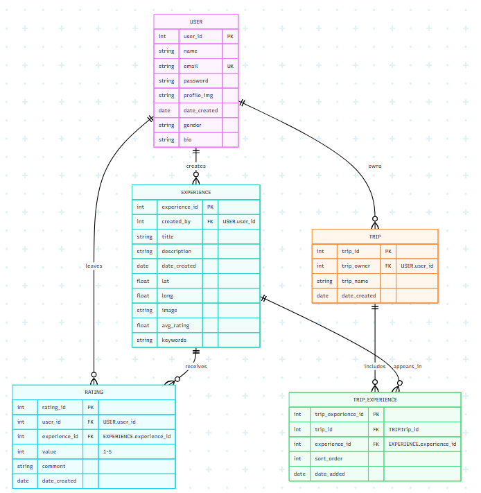

# First Time Setup

To run the server, we need to install node (steps in top level README.md), setup our `.env` file and spin up the database.

## Windows

For Windows users, please see the **[WINDOWS_SETUP.md](../WINDOWS_SETUP.md)** in the root directory for detailed Windows-specific instructions.

Quick setup:
1. `npm i`
2. Copy `env.example.txt` to `.env` and configure it
3. Generate JWT secret: `node -e "console.log(require('crypto').randomBytes(32).toString('hex'))"`
4. `npx prisma generate`
5. `npm run prisma:dev` (or use local PostgreSQL)
6. Copy the `DATABASE_URL` from Prisma dev output to your `.env` file

## MacOS

Run the following from this directory (server) and be sure you followed the shared setup steps on the top level README.md:

1. npm i
2. cp .env.example .env
3. npx prisma generate
   1. This generates the Prisma client (w/ types), which is the ORM we use to interact with our Postgres DB.
4. npm run prisma:dev
   1. This will spin up a Prisma PostgreSQL DB.
   2. Enter `h` and copy the `DATABASE_URL` into your env file. This environment variable is used in on the server to connect to the DB. For example:
5. `openssl genpkey -algorithm RSA -out jwt-secret.key -pkeyopt rsa_keygen_bits:4096`
   1. This is for the JWT signing for our auth layer

```bash
# .env
DATABASE_URL="prisma+postgres://localhost:51213/?api_key=eyJkYXRhYmFzZVVybCI6InBvc3RncmVzOi8vcG9zdGdyZXM6cG9zdGdyZXNAbG9jYWxob3N0OjUxMjE0L3RlbXBsYXRlMT9zc2xtb2RlPWRpc2FibGUmY29ubmVjdGlvbl9saW1pdD0xJmNvbm5lY3RfdGltZW91dD0wJm1heF9pZGxlX2Nvbm5lY3Rpb25fbGlmZXRpbWU9MCZwb29sX3RpbWVvdXQ9MCZzaW5nbGVfdXNlX2Nvbm5lY3Rpb25zPXRydWUmc29ja2V0X3RpbWVvdXQ9MCIsIm5hbWUiOiJkZWZhdWx0Iiwic2hhZG93RGF0YWJhc2VVcmwiOiJwb3N0Z3JlczovL3Bvc3RncmVzOnBvc3RncmVzQGxvY2FsaG9zdDo1MTIxNS90ZW1wbGF0ZTE_c3NsbW9kZT1kaXNhYmxlJmNvbm5lY3Rpb25fbGltaXQ9MSZjb25uZWN0X3RpbWVvdXQ9MCZtYXhfaWRsZV9jb25uZWN0aW9uX2xpZmV0aW1lPTAmcG9vbF90aW1lb3V0PTAmc2luZ2xlX3VzZV9jb25uZWN0aW9ucz10cnVlJnNvY2tldF90aW1lb3V0PTAifQ"
```

# Start Database & Server

Now that you've completed the first time setup, each time you want to work on the server, you just start the database and then the server:

1. npm run prisma:dev
2. npm run start:dev

## Install Dependencies Upon Changes

Whenever there are changes to `package.json`, run `npm install` to make sure your libraries are updated. Otherwise, if you run the application, you may run into errors.

# Prisma

## Run DB

`npm run prisma:dev`

## Prisma Dev Troubleshooting

If Prisma Dev fails with `PGlite failed to initialize properly`, reset this project's local Prisma dev state:

1. `npx prisma dev rm crowd-sourced-travel-planner`
2. `npm run prisma:dev`

## Generate Types

`npx prisma generate`

## Upon Changes

After you make a change to the schema, generate a migration using `npx prisma migrate dev` and then run `npx prisma generate` to generate types.

# Tests

## Integration Tests

Make sure PostgreSQL is running the background for integration tests to run. These are the controller and DB constraint tests, which run against Postgres.

One way to do this is through brew:

1. `brew install postgresql`
2. `brew services start postgresql`

##Database Schema

